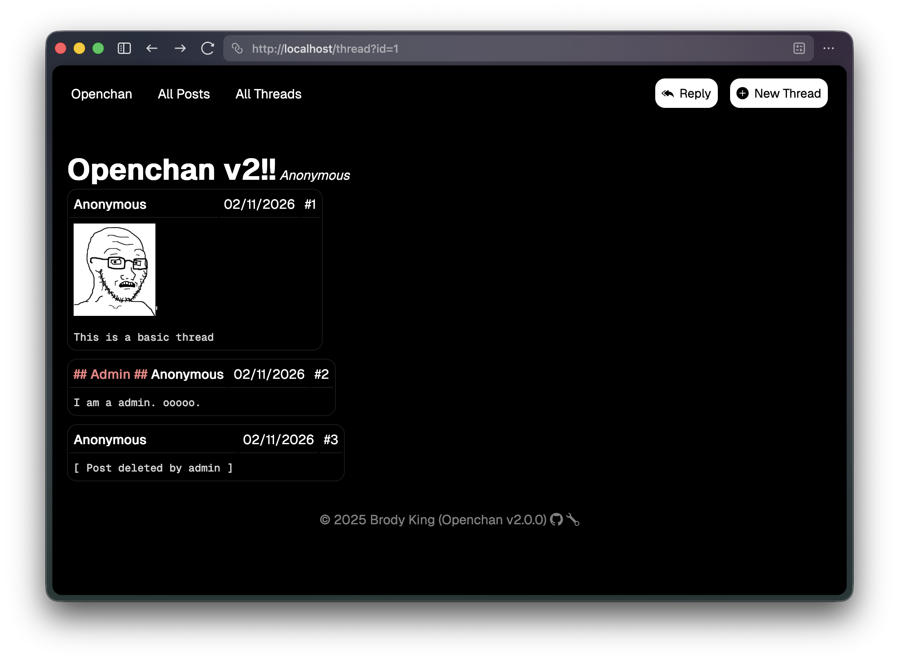

# Openchan 🍀

_" A modern take on imageboard software."_



> [!NOTE]
> If you are looking for the classic, no database version, you can find it in
> the [v1 branch](https://github.com/brodyking/Openchan/tree/v1).

Openchan is a **simple** and **lightweight**, imageboard software with a focus
on modern techonologies. This project utilizes javascript for all frontend
rendering, and PHP for the backend API. This projects small codebase and few
dependencies allows for easy modification. Out of the box, Openchan is simple
and includes just the basics: thread creation, image uploading, and replies.
Apart from that, it is up to the site developer to implement other features.

If you are looking for a more "feature-rich" imageboard software, I would advise
you to checkout [vichan](https://github.com/vichan-devel/vichan). It is a proven
imageboard software also written in PHP with active development.

> [!WARNING]
> This software is in development. Review the codebase before use. Some
> functions may be insecure.

## User Features

- Thread Creation
- Image uploading
- Replies
- Overview of all posts

## Developer Features

- Few dependencies
- SQLite database
- Browser-side rendering/page generation (saves on server processing)

## Requires

- PHP (8+)
- SQLite
- Apache with mod_rewrite

## Installation

1. Clone this repo:

```
git clone https:/github.com/brodyking/openchan
```

2. Start your apache server in the root directory.

3. Change the default admin username/password in `/api/sys/accounts.php`.

## Roadmap

- [x] Thread Creation
- [x] Replies
- [x] Image uploading
- [x] Boards
- [x] Admin panel
