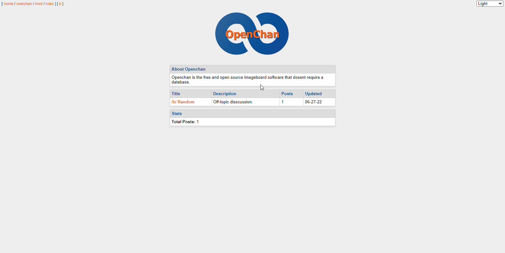

<!-- PROJECT LOGO -->
 

  

  <h3 align="center">Openchan</h3>

  

    A lightweight imageboard script written without a database.
     
  

<!-- ABOUT THE PROJECT -->
## About The Project

There are many imageboard scripts out there for anyone to use, so why this one? Well there is not really a reason. If you like a simplier layout and a more textboard style website that also supports images, then this script is for you! But I still would not reccomend anyone use this script yet. There are a few things that have not been done to make this secure yet. I will talk about it later in this readme.

(<a href="#top">back to top</a>)

### Built With

Usually, this part of the readme would be really big... But not this time! This entire project was written in PHP, so there are no dependencies.

(<a href="#top">back to top</a>)

<!-- GETTING STARTED -->
## Getting Started

This is an example of how you may give instructions on setting up your project locally.
To get a local copy up and running follow these simple example steps.

### Installation

Just clone the repository and start up your PHP server. The PHP used is very basic so almost all versions should work.

(<a href="#top">back to top</a>)

<!-- USAGE EXAMPLES -->
## Usage

To create a new board, just copy the /b/ folder and change the folder name and $bn variable inside of /boardname/index.php. All posts are stored in a database.html file for each board and and images are stored in the /boardname/data/ folder.

_For more examples, please refer to the [Documentation](https://example.com)_

(<a href="#top">back to top</a>)

<!-- ROADMAP -->
## Roadmap

- [x] Add MOAR CSS
- [x] Allow Image Uploading
- [ ] Make it so you cant post <script> inside of your post body
- [ ] Add formatting for greentext and bold. Currently you can use HTML, which is insecure.

(<a href="#top">back to top</a>)

<!-- CONTRIBUTING -->
## Contributing

Contributions are what make the open source community such an amazing place to learn, inspire, and create. Any contributions you make are **greatly appreciated**.

If you have a suggestion that would make this better, please fork the repo and create a pull request. You can also simply open an issue with the tag "enhancement".
Don't forget to give the project a star! Thanks again!

1. Fork the Project
2. Create your Feature Branch (`git checkout -b feature/AmazingFeature`)
3. Commit your Changes (`git commit -m 'Add some AmazingFeature'`)
4. Push to the Branch (`git push origin feature/AmazingFeature`)
5. Open a Pull Request

(<a href="#top">back to top</a>)

<!-- LICENSE -->
## License

This project currently has no license because I am lazy and havent chosen one yet.

(<a href="#top">back to top</a>)

<!-- CONTACT -->
## Contact

Brody King - [mailto:bk.2k@hotmail.com](bk.2k@hotmail.com)

Project Link: [https://github.com/brodyking/Openchan](https://github.com/brodyking/Openchan)

(<a href="#top">back to top</a>)

